# Hirewise technical blueprint

Status: proposed architecture, 11 September 2026. This document describes the complete target; it is not a claim that all capabilities have been implemented. Track evidence in MILESTONES.md.

## A. Product architecture

Modular Django 5.2 LTS monolith with server-rendered, responsive HTML and progressively enhanced forms; PostgreSQL; private S3-compatible storage; database-backed sessions; durable background work; provider adapters for parsing, semantic matching, interviews, mail, and payments. Public pages and authenticated candidate, recruiter, and administrator portals share domain services and authorization rules. UTC persistence, Asia/Qatar display, English initially, translation-ready templates and logical CSS for future Arabic.

The brief prefers Next.js but permits mature equivalents. Django is selected for integrated authentication, CSRF, migrations, forms, ORM, localization, admin and Python document/ML ecosystem. It reduces initial infrastructure and dependency surface. JSON endpoints can support a separate TypeScript client later. Python 3.12 is the deployment runtime; this workstation also supports local development on Python 3.10. SQLite is strictly a local test convenience, never the production database.

## B. Permissions

| Capability | Guest | Candidate | Recruiter | Reviewer (future) | Administrator |
|---|---|---|---|---|---|
| Published vacancies | Read | Read | Read | Read | Moderate |
| Apply | Verified email workflow | Own | No | No | Support only |
| Candidate profile, privacy | Token-scoped workflow | Own | Consented application only | Assigned only | Justified, audited |
| Jobs, applicants, reports | No | Own application projection | Active company membership only | Assigned only | Audited support/moderation |
| Decisions | No | Withdraw own | Human decision with history | Assessment only | Audited correction |
| Billing/team | No | No | Company owner only | No | Manage |
| Global policy, users, audit | No | No | No | No | MFA required |

All checks occur on the server. UUIDs are identifiers, not authorization. Revoked membership and suspended accounts take effect on the next request. Admin rights cannot be selected at registration. No bypass through Django admin URLs. Email verification precedes protected actions. Company approval precedes publication.

## C. Complete target entity diagram

Entities below cover the full requested product. Only milestone-specific tables are migrated at each checkpoint. Roles are constrained values and Django permissions; structured candidate facts use typed records with source references.

```mermaid
erDiagram
 USER ||--o| CANDIDATE_PROFILE : owns
 USER ||--o{ SESSION : authenticates
 USER ||--o{ MFA_DEVICE : secures
 USER ||--o{ EMAIL_TOKEN : verifies
 USER ||--o{ MEMBERSHIP : joins
 COMPANY ||--o{ MEMBERSHIP : authorizes
 COMPANY ||--o{ TEAM_INVITATION : invites
 COMPANY ||--o{ JOB : posts
 JOB ||--o{ JOB_REQUIREMENT : defines
 JOB ||--o{ APPLICATION_QUESTION : asks
 JOB ||--o{ APPLICATION : receives
 USER o|--o{ APPLICATION : submits
 APPLICATION ||--o{ APPLICATION_ANSWER : contains
 APPLICATION ||--o{ STATUS_EVENT : transitions
 APPLICATION ||--o{ RECRUITER_NOTE : annotates
 APPLICATION ||--o{ DOCUMENT : contains
 DOCUMENT ||--o{ DOCUMENT_EXTRACTION : parsed
 DOCUMENT_EXTRACTION ||--o{ CANDIDATE_FACT : supports
 CANDIDATE_PROFILE ||--o{ CANDIDATE_FACT : supplies
 CANDIDATE_FACT ||--o{ FACT_EVIDENCE : substantiates
 JOB ||--o{ SCORING_POLICY_VERSION : versions
 APPLICATION ||--o{ SCREENING_RUN : evaluates
 SCORING_POLICY_VERSION ||--o{ SCREENING_RUN : governs
 AI_MODEL_VERSION ||--o{ SCREENING_RUN : executes
 AI_PROMPT_VERSION ||--o{ SCREENING_RUN : instructs
 SCREENING_RUN ||--o{ SCREENING_SCORE : dimensions
 SCREENING_SCORE ||--o{ SCREENING_EVIDENCE : explains
 FACT_EVIDENCE ||--o{ SCREENING_EVIDENCE : cites
 APPLICATION ||--o{ INTERVIEW : invites
 INTERVIEW_TEMPLATE_VERSION ||--o{ INTERVIEW : structures
 COMPANY ||--o{ INTERVIEW_SLOT : offers
 INTERVIEW_SLOT o|--o| INTERVIEW : reserves
 INTERVIEW ||--o{ INTERVIEW_QUESTION : asks
 INTERVIEW_QUESTION ||--o| INTERVIEW_ANSWER : receives
 INTERVIEW ||--o{ INTERVIEW_ASSESSMENT : evaluates
 USER ||--o{ NOTIFICATION : receives
 APPLICATION ||--o{ CONSENT : authorizes
 LEGAL_DOCUMENT_VERSION ||--o{ CONSENT : explains
 USER o|--o{ PRIVACY_REQUEST : requests
 RETENTION_POLICY ||--o{ APPLICATION : expires
 COMPANY ||--o{ PAYMENT : purchases
 PRICE ||--o{ PAYMENT : prices
 PAYMENT ||--o| INVOICE : receipts
 PAYMENT ||--o{ PAYMENT_EVENT : reconciles
 PAYMENT ||--o{ REFUND : reverses
 COMPANY ||--o{ ENTITLEMENT : unlocks
 COMPANY ||--o{ SUBSCRIPTION : future
 USER o|--o{ AUDIT_EVENT : performs
 USER o|--o{ SECURITY_EVENT : triggers
 USER ||--o{ REPORT_EXPORT : requests
 APPLICATION ||--o{ REPORT_EXPORT : describes
 BACKGROUND_TASK ||--o{ TASK_ATTEMPT : retries
 PLATFORM_SETTING ||--o{ CONFIGURATION_VERSION : changes
 COUNTRY ||--o{ RETENTION_POLICY : governs
 CURRENCY ||--o{ PRICE : denominates
```



Tenant-owned records inherit company scope through their job/application or carry an explicit company foreign key with consistency validation. Index company/status/time, job/application time, user/email, task state/run time; unique memberships, verified application identity per vacancy, provider event IDs and invoice numbers. Monetary values are integer minor units. Policy/run history is append-only. DB service accounts cannot modify audit history; production audit copies go to separate restricted storage. RLS is a defense-in-depth follow-up requiring connection-pooling tests, not a replacement for query authorization.

## D. Workflows

Recruiter: register → verify email → create company → administrator approval → draft vacancy → purchase entitlement if required → moderation → publish → review applications/evidence → request interview → human decision with reason → report.

Candidate: browse → register or guest apply → purpose-specific notice → quarantine upload → submit durable application/reference → verified confirmation → async scan/extract/match → interview invitation/consent → select UTC slot → answer text questions → human review → status tracking/withdrawal/privacy request. Failures preserve the original application and schedule bounded retries. Guest tokens are scoped, expiring and single-use where appropriate; public references reveal no private records.

## E. Matching architecture

Quarantined upload → malware scan → isolated bounded extraction → schema validation → typed candidate facts with document/page/span, confidence and verification labels → job criteria normalization → objective mandatory checks plus curated skill equivalents/approved embeddings → weighted dimensions → evidence-bound explanation. Missing evidence means unknown, not false. Never infer years from unrelated keywords or invent certifications. Protected traits are excluded from scoring inputs. Rule engine, prompt, provider/model, input hashes and policy snapshot are retained per run. Rescreening adds a run. AI never updates hiring status. Blind review hides identity but preserves job-related facts. Local deterministic scoring is explicitly labelled; it must not be marketed as semantic AI. External AI remains disabled until an approved provider and processing agreement are configured.

## F. Interview architecture

Versioned recruiter-approved competency/rubric template → candidate invitation and disclosure → expiring reservation with transactional slot locking → text responses with autosave → schema-validated assessment grounded in answer excerpts → report including unanswered items and human review requirement. No facial, emotion, accent or appearance assessment. Recording is off for text interviews. Audio, video and calendar integrations are future scope. Provider outage leaves responses saved and assessment pending.

## G. Privacy

Minimize fields; no IDs, demographics, scraping, brokers or URL fetching. Separate account identity, submitted documents, extracted claims, recruiter notes and AI outputs. Candidate projections omit internal notes. Versioned notices and per-purpose consent; authenticated requests for access/correction/export/deletion; guest requests require email verification. Jurisdiction-specific retention, legal-hold review and logged deletion jobs. Encrypt transport, managed data/storage and backups; secrets outside source; private document access with short expiry and authorization on issuance. Logs exclude CV text, reset tokens and unnecessary PII. No third-party analytics on private screens.

## H. Security and threat summary

| Threat | Prevention | Detection / response |
|---|---|---|
| Account takeover / credential stuffing | Argon2, verified email, DB-backed throttling, secure expiring sessions, admin TOTP MFA | Failed-login events; revoke sessions and credentials |
| IDOR / tenant leakage / privilege escalation | Server-side role and active membership scope, deny by default, cross-company tests | Access-denied metrics, incident containment and access audit |
| Upload malware / parser denial of service | Private quarantine, signatures/MIME/extension/size, antivirus, isolated resource-limited worker | Scan state and timeout alerts; reject/quarantine |
| CV prompt injection / AI leakage | No tools, minimization, schema/evidence validation, redacted provider payload, explicit provider review | Flag suspicious input, fail to manual review |
| SQLi / XSS / CSRF / SSRF | ORM, escaping, CSP, CSRF, no candidate URL retrieval | Security tests and structured events |
| Payment tampering / spoofing / replay | Hosted checkout, signed callback, exact amount/currency, provider reconciliation, idempotent events | Reconciliation failures; hold entitlement |
| Admin abuse / backups exposure / supply chain | Least privilege, MFA, immutable external audit, encrypted restore-tested backups, locked dependencies and CI audit | Audit review, secret rotation, restore/rollback drills |

Formal threat register records likelihood, impact, owner and residual risk before launch; controls are verified, not assumed from this table.

## I. Hosting

Preview: local container or Render free web service with synthetic data only. Render free web services sleep after 15 minutes; 750 hours/workspace/month; free PostgreSQL has 1 GB, expires after 30 days and lacks backups. Free ephemeral disks must never contain candidate documents or persistent databases. Source: https://render.com/docs/free (checked 2026-09-11).

Production recommendation: managed application service + paid managed PostgreSQL with automated backups + private S3-compatible storage + worker/scanner, all in professionally approved regions. Render and DigitalOcean are deployment options; region, subprocessors and international transfers require review. Do not assume Qatar-local hosting. Alternative: approved Qatar-region cloud infrastructure where contractual requirements demand it. HTTPS, private DB networking, separate environments, monitoring, rollback and external backup are mandatory. No infrastructure purchase is authorized by this proposal.

## J. Qatar payments

PaymentProvider interface: create_payment, verify_payment, refund_payment, receive_webhook, verify_webhook, get_transaction, get_settlement_status. Start with a clearly identified internal test adapter that cannot charge a card or enable live production entitlements. QNB's merchant gateway is a candidate for acquiring credit, prepaid and QPay debit payments. Live adapter depends on merchant-approved protocol/specifications and sandbox credentials; do not invent undocumented endpoints or signatures. Merchant confirmation must cover settlement account, currencies, international acceptance, 3DS, refunds and reconciliation. Webhooks require signature/timestamp/replay validation; confirmation is server-side, never a redirect. No card data enters Hirewise.

Sources checked 2026-09-11: https://qnb.com/sites/qnb/qnbglobal/en/ennews041023news ; https://www.qnb.com.qa/sites/qnb/qnbqatar/page/en/enqpaypayment.html ; https://www.qcb.gov.qa/Services/Financial%20Technology/PSR%20Final%20-%20English.pdf . These establish relevant services/regulatory context, not approval of a particular merchant or legal conclusion.

## K. Monthly cost model (USD, planning assumptions, not quotes)

Assume 2 MB/application, 6 months retained originals plus one encrypted backup, 4 emails/application, text only, 20% interviewed, AI allowance $0.015/application + $0.04/interview. AI numbers are budget assumptions pending provider selection, not published model prices. No transcription cost in text MVP. Payment fees depend on transaction count and merchant agreement, not applicant volume.

| Monthly applications | 1,000 | 10,000 | 100,000 |
|---|---:|---:|---:|
| Web / worker / scanning | 35–70 | 80–180 | 300–900 |
| Managed database / backups | 20–40 | 50–150 | 250–750 |
| Storage / requests / backup allowance | 5–10 | 10–35 | 70–220 |
| Email allowance | 5–15 | 30–60 | 200–500 |
| AI allowance | 23 | 230 | 2,300 |
| Transcription | 0 | 0 | 0 |
| Monitoring allowance | 0–15 | 15–50 | 50–200 |
| Estimated total before payments/tax | 88–173 | 415–705 | 3,170–4,870 |

Storage assumption implies approximately 24/240/2,400 GB including the backup at steady state. Add payment costs = monthly successful charges × negotiated fixed fee + gross receipts × negotiated percentage, plus refund/FX/dispute charges. Domain, labor, legal review, penetration testing and support are excluded. Validate actual provider prices and workload before purchase: https://render.com/pricing ; https://www.digitalocean.com/pricing/managed-databases ; https://www.digitalocean.com/pricing . Upgrade when queue age >5 minutes, sustained DB/CPU >70%, storage >70% allocation, or p95 response >750 ms under measured load.

## L. Milestones

1. Foundation: authentication, verification/reset, MFA admin, roles, company/candidate accounts, database, audit, security tests.
2. Recruitment: jobs/moderation, guest and registered applications, secure uploads, histories.
3. Matching: scan/extract workers, structured evidence, rules/semantic providers, explainable runs.
4. Interviews: templates, invitations, scheduling, text responses, assessments/reports.
5. Commercial: configurable pricing, sandbox checkout, verified events, invoices; live acquiring gated externally.
6. Reporting: paginated dashboards, tenant-scoped reports/exports, aggregate admin analytics.
7. Security/privacy: retention, privacy workflows, threat review, negative tests and recovery verification.
8. Deployment: CI, staging, HTTPS, monitoring, backup drills, reviewed production launch.

Each milestone includes requirements, schema, backend/frontend, tests, fixes, security checks, documentation and a Git checkpoint. Incomplete functions remain explicitly tracked rather than disguised as working integrations.

## M. Repository

```
config/             settings, URL routing, WSGI
hirewise/           domain models, forms, views, services, migrations, tests
templates/          public, account, candidate, recruiter and admin UI
static/             local branding and responsive styles
docs/               blueprint, ADRs, guides, security and operations
deploy/             container and infrastructure configuration
.github/workflows/  test, dependency/security audit, build
manage.py           migrations and management commands
requirements*.txt   dependency inputs and reproducible lock
```

## N. Deployment

Push tested checkpoints to owner repository. CI tests against PostgreSQL, checks migrations, dependency vulnerabilities, static/security checks and container build. Separate staging/production secrets, databases, storage, mail, payment and AI. Run migration as release operation with backup, collect static files, then health-check release; rollback application image only when schema-compatible. Restore drills and scanner/e-mail/provider tests precede real candidate intake. GitHub Pages can serve public static assets but cannot host this authenticated backend.

## O. Professional verification

Qatar counsel must review commercial/recruitment licensing, Law No.13 of 2016 applicability, processing notices, recruitment fairness, AI use, special-nature data, international transfers, subprocessors, rights/retention, commercial registration, contract terms and breach obligations. Accountant confirms invoice and tax configuration. Acquirer confirms merchant onboarding/security/settlement. Reference: NCSA's English law translation explicitly defers to the official Gazette text: https://assurance.ncsa.gov.qa/sites/default/files/library/2020-11/Law%20No.%20%2813%29%20of%202016%20%20on%20Protecting%20Personal%20Data%20Privacy%20-%20English.pdf . This blueprint makes no certification or legal-compliance claim.

## P. Assumptions and external dependencies

Hirewise is the working name supplied through the repository; logo and business/contact/domain settings remain configurable. Qatar, QAR and Asia/Qatar defaults; English and text interviews first; no automatic rejection. Owner has authorized source changes and Git pushes. Paid accounts, AI enrollment, merchant agreements, domain purchase, production DNS and production deletion need explicit approval as specified in the brief. No real applicant data or default production passwords. Deployment credentials, approved region, legal entity details, mail domain, live acquiring and AI agreements are not yet supplied; implementation and local/sandbox testing proceed independently.
